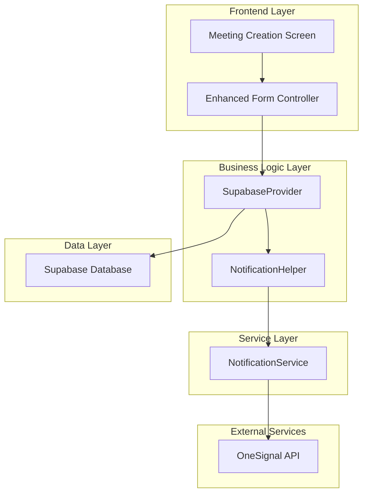
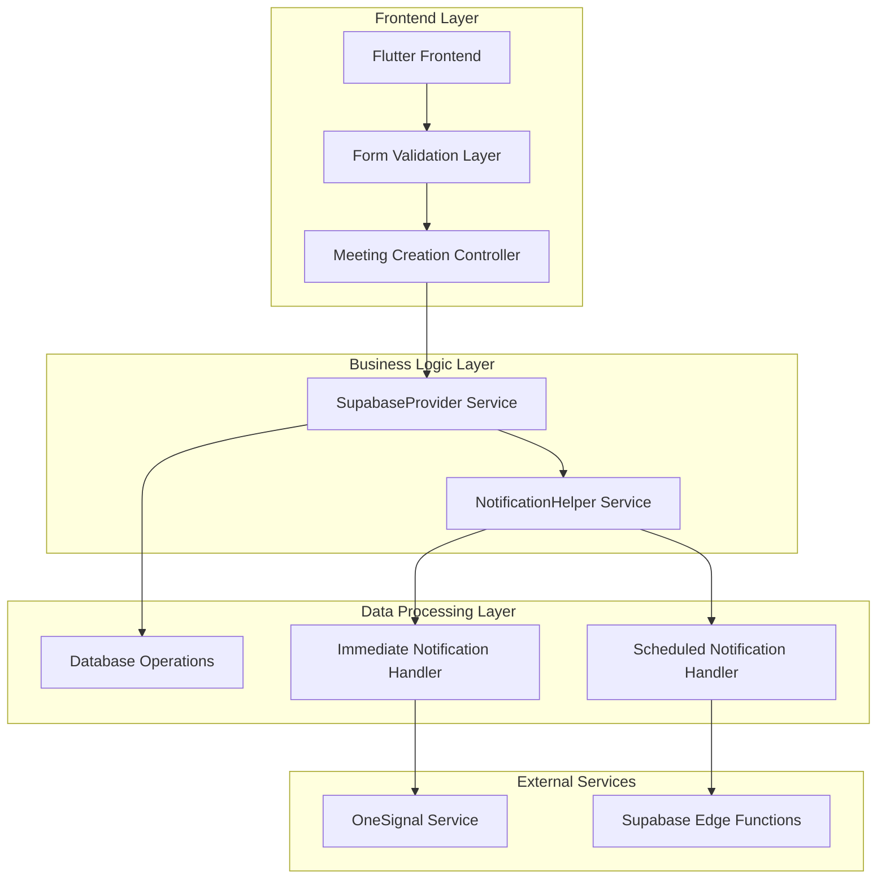
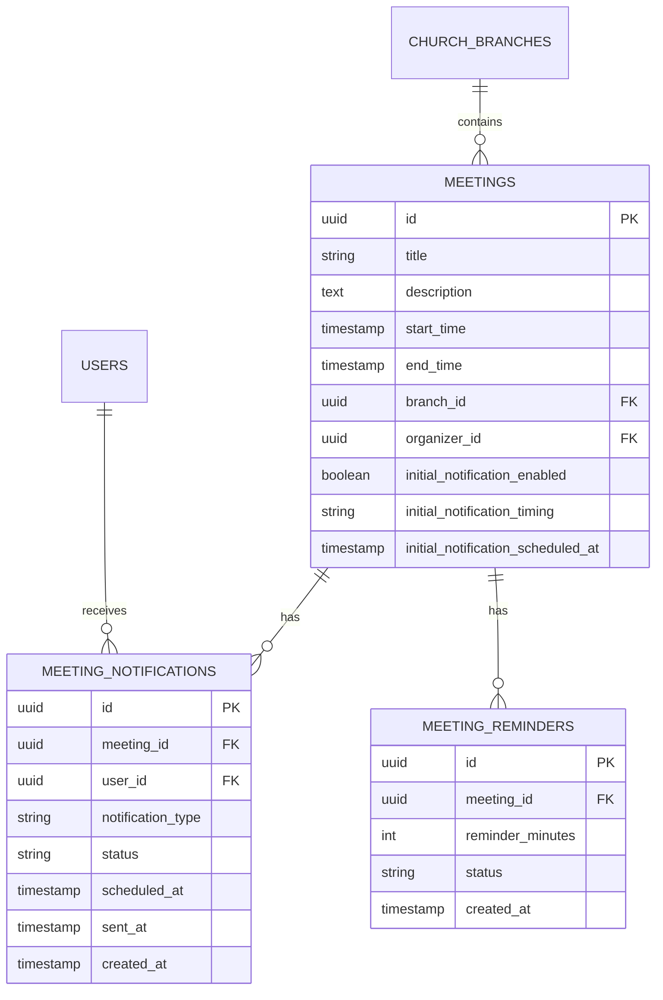

# Meeting Notification Control System - Technical Architecture Document

## 1. Architecture Design



## 2. Technology Description
- Frontend: Flutter@3.x + Material Design + Provider state management
- Backend: Supabase (PostgreSQL + Edge Functions)
- Notifications: OneSignal for push notifications + Supabase for scheduling
- State Management: Provider pattern for form state and notification preferences

## 3. Route Definitions
| Route | Purpose |
|-------|---------|
| /meeting-creation | Enhanced meeting creation screen with notification controls |
| /meeting-details/:id | Meeting details with notification status display |
| /notifications | User notification center (existing, no changes required) |

## 4. API Definitions

### 4.1 Core API

Enhanced meeting creation with notification preferences
```
POST /api/meetings/create-with-notifications
```

Request:
| Param Name | Param Type | isRequired | Description |
|------------|------------|------------|-------------|
| meeting | MeetingModel | true | Meeting details object |
| reminderMinutes | List<int> | false | Reminder times in minutes before meeting |
| initialNotification | InitialNotificationConfig | true | Initial notification configuration |

InitialNotificationConfig:
| Param Name | Param Type | isRequired | Description |
|------------|------------|------------|-------------|
| enabled | boolean | true | Whether to send initial notification |
| timing | NotificationTiming | true | When to send notification (immediate/scheduled/none) |
| scheduledDateTime | DateTime | false | Custom schedule time (required if timing is scheduled) |

Response:
| Param Name | Param Type | Description |
|------------|------------|-------------|
| success | boolean | Operation success status |
| meetingId | string | Created meeting ID |
| notificationStatus | string | Initial notification scheduling status |

Example Request:
```json
{
  "meeting": {
    "title": "Sunday Service",
    "description": "Weekly worship service",
    "dateTime": "2024-01-14T10:00:00Z",
    "branchId": "branch-123"
  },
  "reminderMinutes": [1440, 60, 15],
  "initialNotification": {
    "enabled": true,
    "timing": "scheduled",
    "scheduledDateTime": "2024-01-13T18:00:00Z"
  }
}
```

Schedule initial meeting notification
```
POST /api/notifications/schedule-initial
```

Request:
| Param Name | Param Type | isRequired | Description |
|------------|------------|------------|-------------|
| meetingId | string | true | Meeting identifier |
| scheduledDateTime | DateTime | true | When to send notification |
| branchId | string | true | Target branch for notifications |

## 5. Server Architecture Diagram



## 6. Data Model

### 6.1 Data Model Definition



### 6.2 Data Definition Language

Enhanced Meetings Table
```sql
-- Add new columns to existing meetings table
ALTER TABLE meetings ADD COLUMN IF NOT EXISTS initial_notification_enabled BOOLEAN DEFAULT true;
ALTER TABLE meetings ADD COLUMN IF NOT EXISTS initial_notification_timing VARCHAR(20) DEFAULT 'immediate' CHECK (initial_notification_timing IN ('immediate', 'scheduled', 'none'));
ALTER TABLE meetings ADD COLUMN IF NOT EXISTS initial_notification_scheduled_at TIMESTAMP WITH TIME ZONE;

-- Create index for notification scheduling queries
CREATE INDEX IF NOT EXISTS idx_meetings_notification_schedule 
ON meetings(initial_notification_scheduled_at) 
WHERE initial_notification_enabled = true AND initial_notification_timing = 'scheduled';
```

Meeting Notifications Table
```sql
-- Create table for tracking notification delivery
CREATE TABLE IF NOT EXISTS meeting_notifications (
    id UUID PRIMARY KEY DEFAULT gen_random_uuid(),
    meeting_id UUID REFERENCES meetings(id) ON DELETE CASCADE,
    user_id UUID REFERENCES users(id) ON DELETE CASCADE,
    notification_type VARCHAR(50) NOT NULL CHECK (notification_type IN ('initial', 'reminder')),
    status VARCHAR(20) DEFAULT 'pending' CHECK (status IN ('pending', 'sent', 'failed', 'cancelled')),
    scheduled_at TIMESTAMP WITH TIME ZONE,
    sent_at TIMESTAMP WITH TIME ZONE,
    created_at TIMESTAMP WITH TIME ZONE DEFAULT NOW(),
    updated_at TIMESTAMP WITH TIME ZONE DEFAULT NOW()
);

-- Create indexes for efficient querying
CREATE INDEX idx_meeting_notifications_meeting_id ON meeting_notifications(meeting_id);
CREATE INDEX idx_meeting_notifications_user_id ON meeting_notifications(user_id);
CREATE INDEX idx_meeting_notifications_scheduled ON meeting_notifications(scheduled_at) WHERE status = 'pending';
CREATE INDEX idx_meeting_notifications_type ON meeting_notifications(notification_type);
```

Database Functions
```sql
-- Function to schedule initial meeting notifications
CREATE OR REPLACE FUNCTION schedule_initial_meeting_notification(
    p_meeting_id UUID,
    p_scheduled_at TIMESTAMP WITH TIME ZONE DEFAULT NOW()
)
RETURNS VOID AS $$
DECLARE
    meeting_record RECORD;
    user_record RECORD;
BEGIN
    -- Get meeting details
    SELECT * INTO meeting_record FROM meetings WHERE id = p_meeting_id;
    
    IF NOT FOUND THEN
        RAISE EXCEPTION 'Meeting not found';
    END IF;
    
    -- Only proceed if initial notifications are enabled
    IF meeting_record.initial_notification_enabled THEN
        -- Get all users in the meeting's branch
        FOR user_record IN 
            SELECT id FROM users WHERE branch_id = meeting_record.branch_id
        LOOP
            -- Insert notification record
            INSERT INTO meeting_notifications (
                meeting_id,
                user_id,
                notification_type,
                scheduled_at,
                status
            ) VALUES (
                p_meeting_id,
                user_record.id,
                'initial',
                p_scheduled_at,
                CASE WHEN p_scheduled_at <= NOW() THEN 'pending' ELSE 'pending' END
            );
        END LOOP;
    END IF;
END;
$$ LANGUAGE plpgsql;

-- Function to get pending notifications for processing
CREATE OR REPLACE FUNCTION get_pending_notifications()
RETURNS TABLE (
    notification_id UUID,
    meeting_id UUID,
    user_id UUID,
    meeting_title TEXT,
    notification_type VARCHAR(50),
    scheduled_at TIMESTAMP WITH TIME ZONE
) AS $$
BEGIN
    RETURN QUERY
    SELECT 
        mn.id,
        mn.meeting_id,
        mn.user_id,
        m.title,
        mn.notification_type,
        mn.scheduled_at
    FROM meeting_notifications mn
    JOIN meetings m ON mn.meeting_id = m.id
    WHERE mn.status = 'pending' 
    AND mn.scheduled_at <= NOW()
    ORDER BY mn.scheduled_at ASC;
END;
$$ LANGUAGE plpgsql;
```