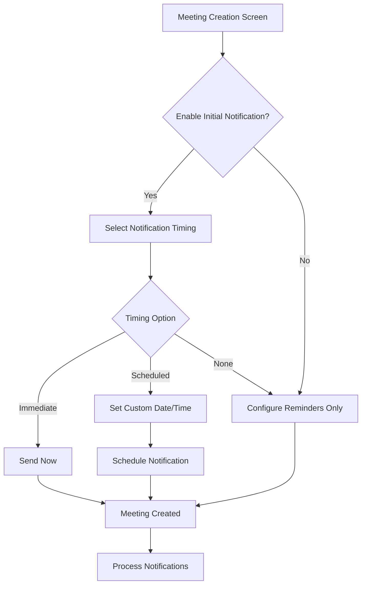

# Meeting Notification Control System - Product Requirements Document

## 1. Product Overview
This feature enhances the meeting creation experience by providing organizers with flexible control over when and how users are notified about newly created meetings, separate from meeting reminder notifications.

The system addresses the need for better notification timing control, allowing organizers to choose optimal notification schedules based on meeting urgency, audience, and organizational preferences while maintaining the existing reminder system for pre-meeting alerts.

## 2. Core Features

### 2.1 User Roles
| Role | Registration Method | Core Permissions |
|------|---------------------|------------------|
| Meeting Organizer | Existing user authentication | Can create meetings and control notification timing |
| Branch Members | Existing user authentication | Receive notifications based on organizer's settings |
| Pastor/Admin | Existing role-based access | Full meeting management and notification oversight |

### 2.2 Feature Module
Our meeting notification control system consists of the following enhanced pages:
1. **Meeting Creation Screen**: Enhanced form with notification timing controls, initial notification settings, reminder configuration.
2. **Meeting Details Screen**: Display notification status and timing information for organizers.
3. **Notification Management**: Backend processing for scheduled and immediate notifications.

### 2.3 Page Details
| Page Name | Module Name | Feature description |
|-----------|-------------|---------------------|
| Meeting Creation Screen | Initial Notification Control | Toggle switch to enable/disable initial meeting notifications with clear labeling |
| Meeting Creation Screen | Notification Timing Options | Radio button selection for immediate, scheduled, or no initial notification |
| Meeting Creation Screen | Custom Schedule Picker | Date and time picker for custom notification scheduling with validation |
| Meeting Creation Screen | Reminder Settings Section | Existing reminder functionality clearly separated from initial notifications |
| Meeting Details Screen | Notification Status Display | Show current notification settings and delivery status for organizers |
| Backend Processing | Scheduled Notification Handler | Process and deliver notifications at specified times using existing infrastructure |

## 3. Core Process

### Meeting Organizer Flow:
1. **Meeting Creation**: Organizer accesses meeting creation screen
2. **Basic Meeting Details**: Fills in title, description, date, time, location
3. **Initial Notification Control**: Toggles "Notify users about this meeting" option
4. **Notification Timing Selection**: Chooses from immediate, scheduled, or no notification
5. **Custom Scheduling** (if selected): Sets specific date and time for notification delivery
6. **Reminder Configuration**: Sets up meeting reminders (existing functionality)
7. **Meeting Creation**: Submits form and meeting is created with notification preferences
8. **Notification Processing**: System handles notification delivery based on selected timing

### Branch Member Flow:
1. **Notification Reception**: Receives initial meeting notification based on organizer's timing choice
2. **Meeting Awareness**: Views meeting details and can respond with RSVP
3. **Reminder Reception**: Receives pre-meeting reminders as configured by organizer

## 4. User Interface Design

### 4.1 Design Style
- **Primary Colors**: Blue (#2196F3) for notification controls, Green (#4CAF50) for enabled states
- **Secondary Colors**: Grey (#757575) for disabled states, Orange (#FF9800) for scheduled notifications
- **Button Style**: Rounded corners with subtle shadows, consistent with existing app design
- **Font**: Roboto 16px for labels, 14px for descriptions, 12px for helper text
- **Layout Style**: Card-based sections with clear visual separation between initial notifications and reminders
- **Icon Style**: Material Design icons for notification states (bell, clock, check)

### 4.2 Page Design Overview
| Page Name | Module Name | UI Elements |
|-----------|-------------|-------------|
| Meeting Creation Screen | Initial Notification Section | Card container with toggle switch, section header "Initial Meeting Notification", descriptive text explaining the feature |
| Meeting Creation Screen | Timing Options | Radio button group with icons, immediate (bell icon), scheduled (clock icon), none (bell-off icon) |
| Meeting Creation Screen | Custom Scheduler | Date picker with calendar icon, time picker with clock icon, validation messages in red |
| Meeting Creation Screen | Reminder Section | Existing UI with clear visual separator, header "Meeting Reminders", chip-based time selection |
| Meeting Details Screen | Notification Status | Status badges showing notification state, timestamp displays, delivery confirmation icons |

### 4.3 Responsiveness
The feature is designed mobile-first with adaptive layouts for tablets and desktop. Touch-optimized controls ensure easy interaction on mobile devices, with larger touch targets for toggle switches and radio buttons. The interface maintains consistency with the existing Flutter Material Design implementation.