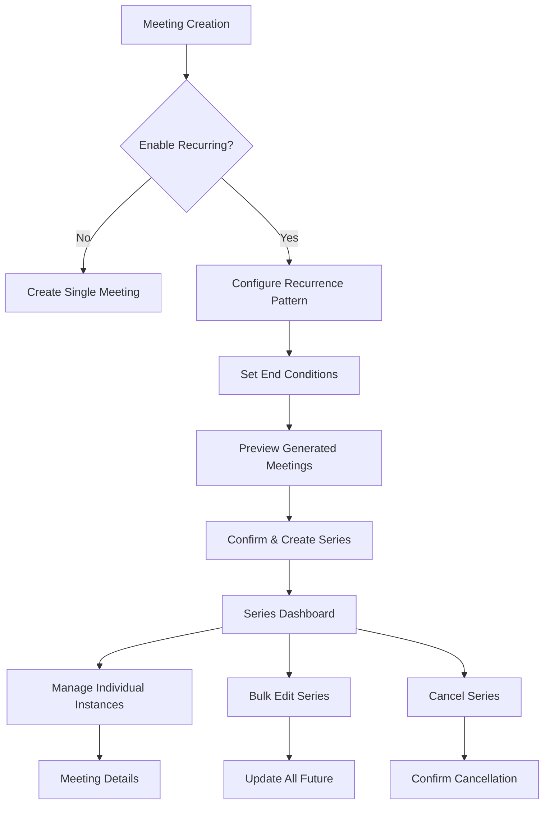

# Recurring Meetings Feature - Product Requirements Document

## 1. Product Overview

This feature enables church administrators and pastors to create recurring meetings that automatically generate multiple meeting instances based on specified patterns (weekly, bi-weekly, monthly, etc.), eliminating the need to manually recreate regular church activities like Sunday services, Bible studies, and committee meetings.

The recurring meetings feature streamlines church event management by automating the creation of repetitive meetings while maintaining consistent notification settings and branch-specific visibility rules across all generated instances.

This enhancement will significantly reduce administrative overhead for church staff and ensure consistent communication with congregation members about regular church activities.

## 2. Core Features

### 2.1 User Roles

| Role          | Registration Method | Core Permissions                                                             |
| ------------- | ------------------- | ---------------------------------------------------------------------------- |
| Pastor        | Admin assignment    | Can create, edit, and manage all recurring meetings across all branches      |
| Administrator | Admin assignment    | Can create, edit, and manage all recurring meetings across all branches      |
| Regular User  | Email registration  | Can view recurring meetings based on branch membership, participate in RSVPs |

### 2.2 Feature Module

Our recurring meetings feature consists of the following enhanced pages:

1. **Meeting Creation Page**: Enhanced with recurring options, pattern selection, end conditions, and preview functionality.
2. **Meeting Management Page**: Bulk management tools, recurring series overview, and individual instance controls.
3. **Meeting Details Page**: Series information display, edit options (single vs. all future), and cancellation controls.
4. **Recurring Series Dashboard**: Overview of all active recurring series with management controls.

### 2.3 Page Details

| Page Name                  | Module Name           | Feature description                                                                                                                         |
| -------------------------- | --------------------- | ------------------------------------------------------------------------------------------------------------------------------------------- |
| Meeting Creation Page      | Recurrence Settings   | Toggle recurring option, select pattern (weekly/bi-weekly/monthly/custom), set end conditions (until date/after X occurrences/indefinitely) |
| Meeting Creation Page      | Pattern Configuration | Configure interval (every X weeks/months), select specific days for weekly patterns, choose date for monthly patterns                       |
| Meeting Creation Page      | Preview & Validation  | Display upcoming meeting dates, validate recurrence rules, show notification inheritance summary                                            |
| Meeting Management Page    | Series Overview       | List all recurring series with status, next occurrence, and total instances                                                                 |
| Meeting Management Page    | Bulk Actions          | Edit all future meetings, cancel entire series, modify recurrence pattern                                                                   |
| Meeting Details Page       | Series Information    | Display parent series details, show position in series (e.g., "3 of 10"), link to series management                                         |
| Meeting Details Page       | Instance Management   | Edit single instance, edit all future instances, remove from series                                                                         |
| Recurring Series Dashboard | Active Series List    | View all active recurring series with quick stats and management shortcuts                                                                  |
| Recurring Series Dashboard | Series Analytics      | Show attendance patterns, notification effectiveness, and series completion rates                                                           |

## 3. Core Process

### Admin/Pastor Flow:

1. **Create Recurring Meeting**: Navigate to meeting creation, fill basic details, enable recurring option, configure pattern and end conditions
2. **Preview Series**: Review generated meeting dates, verify notification settings inheritance, confirm creation
3. **Manage Series**: Access series dashboard, view all active series, perform bulk edits or cancellations
4. **Edit Individual Instance**: From meeting details, choose to edit single instance or all future instances
5. **Monitor Performance**: Review series analytics, track attendance patterns, adjust settings as needed

### Regular User Flow:

1. **View Recurring Meetings**: See upcoming meetings from recurring series in home screen and meetings list
2. **RSVP to Instances**: Respond to individual meeting instances based on branch membership
3. **Receive Notifications**: Get notifications for each meeting instance according to inherited timing settings
4. **Track Series**: Understand which meetings are part of recurring series through visual indicators

## 4. User Interface Design

### 4.1 Design Style

* **Primary Colors**: #1976D2 (Blue) for recurring indicators, #4CAF50 (Green) for active series

* **Secondary Colors**: #FF9800 (Orange) for warnings, #F44336 (Red) for cancellations

* **Button Style**: Rounded buttons with subtle shadows, recurring-specific actions use outlined style

* **Font**: Google Fonts Inter, 16px for body text, 18px for section headers, 14px for helper text

* **Layout Style**: Card-based design with clear visual hierarchy, expandable sections for advanced options

* **Icons**: Material Design icons with recurring-specific symbols (repeat, series, calendar\_view\_week)

### 4.2 Page Design Overview

| Page Name                  | Module Name       | UI Elements                                                                                               |
| -------------------------- | ----------------- | --------------------------------------------------------------------------------------------------------- |
| Meeting Creation Page      | Recurrence Toggle | Switch component with clear labeling, expandable section revealing recurrence options when enabled        |
| Meeting Creation Page      | Pattern Selector  | Radio buttons for common patterns (Weekly, Bi-weekly, Monthly), dropdown for custom intervals             |
| Meeting Creation Page      | End Conditions    | Radio buttons for end types, date picker for "until date", number input for "after X occurrences"         |
| Meeting Creation Page      | Preview Section   | Scrollable list showing first 5-10 generated meetings, "Show more" expansion, notification timing summary |
| Meeting Management Page    | Series Cards      | Compact cards showing series title, pattern, next meeting, total instances, quick action buttons          |
| Meeting Details Page       | Series Badge      | Prominent badge indicating "Part of recurring series", link to series overview                            |
| Meeting Details Page       | Edit Options      | Split button: "Edit This Meeting" vs "Edit All Future Meetings" with clear descriptions                   |
| Recurring Series Dashboard | Series List       | Table view with sortable columns: Title, Pattern, Next Meeting, Total Instances, Status, Actions          |

### 4.3 Responsiveness

The recurring meetings feature is designed mobile-first with adaptive layouts. Touch interactions are optimized for mobile devices, with larger touch targets for pattern selection and easy-to-use date pickers. Desktop users benefit from enhanced table views and bulk selection capabilities.

## 5. Technical Requirements

### 5.1 Data Storage

* Extend existing MeetingModel with recurrence fields

* Store recurrence rules in structured metadata

* Implement parent-child relationship for series tracking

* Support efficient querying of recurring series

### 5.2 Performance Considerations

* Generate meetings on-demand rather than pre-creating all instances

* Implement pagination for large recurring series

* Cache frequently accessed series data

* Optimize database queries for recurring meeting lookups

### 5.3 Notification Integration

* Inherit notification settings from parent meeting

* Calculate notification timing for each generated instance

* Support modification of notification settings for entire series

* Maintain notification history for recurring series

### 5.4 Business Rules

* Maximum 2 years for recurring series duration

* Limit of 100 instances per recurring series

* Automatic cleanup of completed recurring series

* Validation of recurrence patterns against business hours

