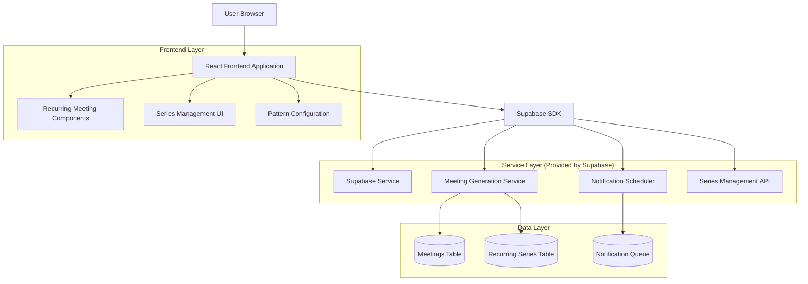
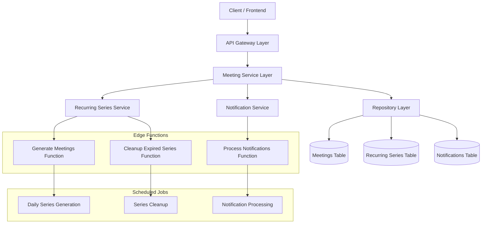
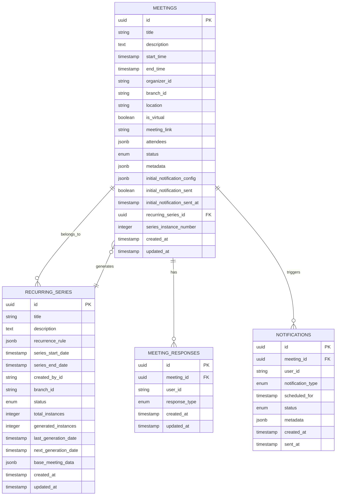

# Recurring Meetings Feature - Technical Architecture Document

## 1. Architecture Design



## 2. Technology Description

- Frontend: React@18 + tailwindcss@3 + vite
- Backend: Supabase (PostgreSQL + Edge Functions)
- Additional Libraries: date-fns for date manipulation, react-hook-form for complex form handling
- State Management: React Context for recurring series state

## 3. Route Definitions

| Route | Purpose |
|-------|---------|
| /meetings/create | Enhanced meeting creation page with recurring options |
| /meetings/series | Recurring series dashboard and management |
| /meetings/series/:id | Individual series details and bulk management |
| /meetings/:id | Meeting details with series context and edit options |
| /meetings/series/:id/edit | Edit entire recurring series settings |

## 4. API Definitions

### 4.1 Core API

**Recurring Series Management**

```
POST /api/meetings/recurring
```

Request:
| Param Name | Param Type | isRequired | Description |
|------------|------------|------------|-------------|
| meetingData | MeetingModel | true | Base meeting information |
| recurrenceRule | RecurrenceRule | true | Pattern and end conditions |
| generateCount | number | false | Number of instances to pre-generate (default: 10) |

Response:
| Param Name | Param Type | Description |
|------------|------------|-------------|
| seriesId | string | Unique identifier for the recurring series |
| generatedMeetings | MeetingModel[] | Array of generated meeting instances |
| nextGenerationDate | string | When next batch will be generated |

Example:
```json
{
  "meetingData": {
    "title": "Sunday Service",
    "description": "Weekly worship service",
    "dateTime": "2024-01-07T11:00:00Z",
    "endTime": "2024-01-07T13:00:00Z",
    "location": "Main Sanctuary",
    "branchId": "branch-123",
    "initialNotificationConfig": {
      "enabled": true,
      "timing": "scheduled",
      "scheduledDateTime": "2024-01-07T10:00:00Z"
    }
  },
  "recurrenceRule": {
    "pattern": "weekly",
    "interval": 1,
    "endType": "until",
    "endDate": "2024-12-31T23:59:59Z"
  }
}
```

**Series Management**

```
GET /api/meetings/series/:id
```

Response:
| Param Name | Param Type | Description |
|------------|------------|-------------|
| series | RecurringSeries | Series metadata and settings |
| upcomingMeetings | MeetingModel[] | Next 10 upcoming meetings |
| totalInstances | number | Total meetings in series |
| completedInstances | number | Past meetings count |

```
PUT /api/meetings/series/:id
```

Request:
| Param Name | Param Type | isRequired | Description |
|------------|------------|------------|-------------|
| updateType | string | true | "single", "future", or "all" |
| meetingData | Partial<MeetingModel> | true | Fields to update |
| fromDate | string | false | Required for "future" updates |

```
DELETE /api/meetings/series/:id
```

Request:
| Param Name | Param Type | isRequired | Description |
|------------|------------|------------|-------------|
| cancelType | string | true | "future" or "all" |
| fromDate | string | false | Required for "future" cancellations |

**Meeting Generation**

```
POST /api/meetings/series/:id/generate
```

Request:
| Param Name | Param Type | isRequired | Description |
|------------|------------|------------|-------------|
| count | number | true | Number of additional meetings to generate |
| fromDate | string | false | Start date for generation |

## 5. Server Architecture Diagram



## 6. Data Model

### 6.1 Data Model Definition



### 6.2 Data Definition Language

**Recurring Series Table**
```sql
-- Create recurring_series table
CREATE TABLE recurring_series (
    id UUID PRIMARY KEY DEFAULT gen_random_uuid(),
    title VARCHAR(255) NOT NULL,
    description TEXT,
    recurrence_rule JSONB NOT NULL,
    series_start_date TIMESTAMP WITH TIME ZONE NOT NULL,
    series_end_date TIMESTAMP WITH TIME ZONE,
    created_by_id UUID NOT NULL,
    branch_id UUID,
    status VARCHAR(20) DEFAULT 'active' CHECK (status IN ('active', 'paused', 'completed', 'cancelled')),
    total_instances INTEGER DEFAULT 0,
    generated_instances INTEGER DEFAULT 0,
    last_generation_date TIMESTAMP WITH TIME ZONE,
    next_generation_date TIMESTAMP WITH TIME ZONE,
    base_meeting_data JSONB NOT NULL,
    created_at TIMESTAMP WITH TIME ZONE DEFAULT NOW(),
    updated_at TIMESTAMP WITH TIME ZONE DEFAULT NOW()
);

-- Add indexes for performance
CREATE INDEX idx_recurring_series_status ON recurring_series(status);
CREATE INDEX idx_recurring_series_branch_id ON recurring_series(branch_id);
CREATE INDEX idx_recurring_series_next_generation ON recurring_series(next_generation_date);
CREATE INDEX idx_recurring_series_created_by ON recurring_series(created_by_id);

-- Add foreign key constraints
ALTER TABLE recurring_series 
ADD CONSTRAINT fk_recurring_series_created_by 
FOREIGN KEY (created_by_id) REFERENCES auth.users(id);

ALTER TABLE recurring_series 
ADD CONSTRAINT fk_recurring_series_branch 
FOREIGN KEY (branch_id) REFERENCES church_branches(id);
```

**Update Meetings Table**
```sql
-- Add recurring series fields to meetings table
ALTER TABLE meetings 
ADD COLUMN recurring_series_id UUID,
ADD COLUMN series_instance_number INTEGER;

-- Add foreign key constraint
ALTER TABLE meetings 
ADD CONSTRAINT fk_meetings_recurring_series 
FOREIGN KEY (recurring_series_id) REFERENCES recurring_series(id);

-- Add indexes
CREATE INDEX idx_meetings_recurring_series_id ON meetings(recurring_series_id);
CREATE INDEX idx_meetings_series_instance ON meetings(recurring_series_id, series_instance_number);
```

**Recurrence Rule JSONB Structure**
```sql
-- Example recurrence_rule JSONB structure
INSERT INTO recurring_series (
    title, 
    description, 
    recurrence_rule, 
    series_start_date,
    created_by_id,
    branch_id,
    base_meeting_data
) VALUES (
    'Sunday Service',
    'Weekly worship service',
    '{
        "pattern": "weekly",
        "interval": 1,
        "daysOfWeek": [0],
        "endType": "until",
        "endDate": "2024-12-31T23:59:59Z",
        "maxInstances": 52
    }',
    '2024-01-07T11:00:00Z',
    'user-uuid',
    'branch-uuid',
    '{
        "title": "Sunday Service",
        "description": "Weekly worship service",
        "location": "Main Sanctuary",
        "isVirtual": false,
        "initialNotificationConfig": {
            "enabled": true,
            "timing": "scheduled",
            "minutesBefore": 60
        }
    }'
);
```

**Edge Function for Meeting Generation**
```sql
-- Function to generate recurring meetings
CREATE OR REPLACE FUNCTION generate_recurring_meetings(
    series_id UUID,
    generation_count INTEGER DEFAULT 10
) RETURNS TABLE (
    meeting_id UUID,
    meeting_date TIMESTAMP WITH TIME ZONE
) AS $$
DECLARE
    series_record recurring_series%ROWTYPE;
    base_data JSONB;
    rule JSONB;
    current_date TIMESTAMP WITH TIME ZONE;
    end_date TIMESTAMP WITH TIME ZONE;
    instance_count INTEGER;
    generated_count INTEGER := 0;
BEGIN
    -- Get series information
    SELECT * INTO series_record FROM recurring_series WHERE id = series_id;
    
    IF NOT FOUND THEN
        RAISE EXCEPTION 'Recurring series not found';
    END IF;
    
    rule := series_record.recurrence_rule;
    base_data := series_record.base_meeting_data;
    current_date := COALESCE(series_record.last_generation_date, series_record.series_start_date);
    end_date := series_record.series_end_date;
    instance_count := series_record.generated_instances;
    
    -- Generate meetings based on recurrence rule
    WHILE generated_count < generation_count AND 
          (end_date IS NULL OR current_date <= end_date) AND
          (rule->>'maxInstances' IS NULL OR instance_count < (rule->>'maxInstances')::INTEGER) LOOP
        
        -- Calculate next occurrence based on pattern
        IF rule->>'pattern' = 'weekly' THEN
            current_date := current_date + INTERVAL '1 week' * (rule->>'interval')::INTEGER;
        ELSIF rule->>'pattern' = 'monthly' THEN
            current_date := current_date + INTERVAL '1 month' * (rule->>'interval')::INTEGER;
        END IF;
        
        -- Insert new meeting
        INSERT INTO meetings (
            title,
            description,
            start_time,
            end_time,
            organizer_id,
            branch_id,
            location,
            is_virtual,
            meeting_link,
            initial_notification_config,
            recurring_series_id,
            series_instance_number,
            metadata
        ) VALUES (
            base_data->>'title',
            base_data->>'description',
            current_date,
            current_date + (base_data->>'duration')::INTERVAL,
            series_record.created_by_id,
            series_record.branch_id,
            base_data->>'location',
            (base_data->>'isVirtual')::BOOLEAN,
            base_data->>'meetingLink',
            base_data->'initialNotificationConfig',
            series_id,
            instance_count + 1,
            jsonb_build_object('generatedAt', NOW())
        ) RETURNING id, start_time INTO meeting_id, meeting_date;
        
        generated_count := generated_count + 1;
        instance_count := instance_count + 1;
        
        RETURN NEXT;
    END LOOP;
    
    -- Update series metadata
    UPDATE recurring_series 
    SET 
        generated_instances = instance_count,
        last_generation_date = current_date,
        next_generation_date = CASE 
            WHEN generated_count > 0 THEN current_date + INTERVAL '1 week'
            ELSE next_generation_date
        END,
        updated_at = NOW()
    WHERE id = series_id;
    
END;
$$ LANGUAGE plpgsql;
```

**Row Level Security Policies**
```sql
-- RLS for recurring_series table
ALTER TABLE recurring_series ENABLE ROW LEVEL SECURITY;

-- Users can view series in their branch or global series
CREATE POLICY "Users can view recurring series in their branch" ON recurring_series
    FOR SELECT USING (
        branch_id IS NULL OR 
        branch_id IN (
            SELECT branch_id FROM user_profiles 
            WHERE user_id = auth.uid()
        )
    );

-- Only admins and pastors can create/modify series
CREATE POLICY "Admins and pastors can manage recurring series" ON recurring_series
    FOR ALL USING (
        EXISTS (
            SELECT 1 FROM user_profiles 
            WHERE user_id = auth.uid() 
            AND role IN ('admin', 'pastor')
        )
    );
```